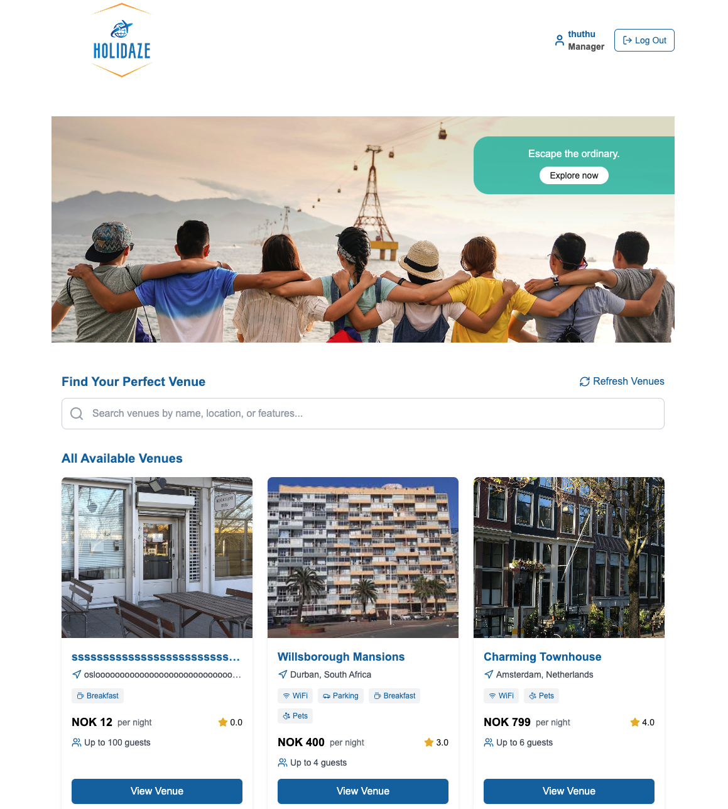

# Holidaze - Your Holiday Accommodation Platform



Holidaze is a modern web application built with Next.js that helps users find and book holiday accommodations. Whether you're looking for a cozy cabin in the woods or a beachfront villa, Holidaze makes it easy to discover and book your perfect holiday stay.

## Features

### For all user

- May view a list of Venues.
- May search for a specific Venue.
- May view a specific Venue page by id.
- May register as a customer with a stud.noroff.no email address and password.
- May register as a Venue Manager with a stud.noroff.no email address and password.
- May view a calendar with available dates for a Venue. Should dates be booked this must be indicated within the calendar.

### For Guests

- May login and log out once registered.
- Browse and search available accommodations.
- Filter properties by location, price, and amenities.
- View detailed property information including photos, descriptions, and reviews.
- Book your stay with a simple booking process.
- Manage your bookings and view booking history.
- Create and manage your user profile,update their avatar/profile picture.

### For Venue Managers

- List and manage your properties detail and photos.
- Update property availability and pricing.
- May edit/update a Venue they manage.
- May delete a Venue they manage.
- May view upcoming bookings made at a Venue they manage.

## Tech Stack

### Frontend

- Next.js 14 with App Router for server-side rendering and routing
- React for building interactive user interfaces
- TypeScript for type safety and better development experience
- Tailwind CSS for responsive and modern styling
- React Query for efficient data fetching and caching
- React Hook Form for form handling and validation

### Backend Integration

- Noroff API (v2) for all backend functionality
  - Venue management endpoints
  - Booking system
  - User authentication and authorization
  - Profile management
  - Media handling
- RESTful API integration
- JWT authentication via Noroff API

## Getting Started

1. Clone the repository:

```bash
git clone [https://github.com/Mithu225/Project-Exam-2---holidaze]
cd Project-Exam-2---holidaze
```

2. Install dependencies:

```bash
npm install
```


3. Run the development server:

```bash
npm run dev
```

4. Open [http://localhost:3000](http://localhost:3000) with your browser to see the application.

## API Integration

The application integrates with the Noroff API (v2) for all backend functionality. Key endpoints include:

- `/holidaze/venues` - Venue management
- `/holidaze/bookings` - Booking system
- `/holidaze/profiles` - User profiles
- `/auth/login` - User authentication
- `/auth/register` - User registration

For detailed API documentation, visit: [Noroff API Documentation](https://v2.api.noroff.dev/docs/static/index.html)

## Development Guidelines

### Code Style

- Follow TypeScript best practices
- Use functional components with hooks
- Implement proper error handling
- Write meaningful comments
- Follow the project's established naming conventions

### Git Workflow

1. Create feature branches from main
2. Write meaningful commit messages
3. Create pull requests for code review
4. Ensure all tests pass before merging

### Testing

- Write unit tests for components
- Test API integration
- Perform integration testing
- Test responsive design across devices

## Deployment

The application can be deployed to any platform that supports Next.js applications. Follow these steps:

1. Build the application:

```bash
npm run build
```

2. Start the production server:

```bash
npm start
```

## Contributing

1. Fork the repository
2. Create your feature branch
3. Commit your changes
4. Push to the branch
5. Create a Pull Request

## License

This project is licensed under the MIT License. See the [LICENSE](LICENSE) file for details.
